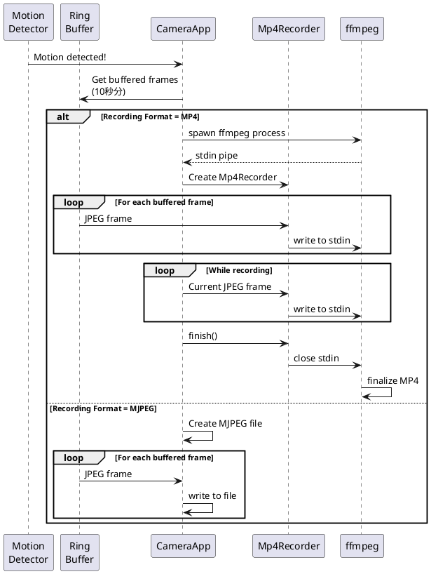

# MP4直接保存機能 仕様案

## 📋 ドキュメント情報

- **作成日**: 2026-01-02
- **目的**: 録画を直接MP4形式で保存
- **前提**: Phase 3録画機能（MJPEG形式）が実装済み

---

## 1. 要件

### 1.1 ユーザー要件

> 動画をmp4で保存してほしい

**現状（Phase 3）:**
- 録画形式: MJPEG（連結されたJPEGフレーム）
- MP4変換: 録画後に変換スクリプト（`convert_to_mp4.sh/bat`）を手動実行

**改善要件:**
- ✅ 録画時に直接MP4形式で保存
- ✅ 変換作業の自動化
- ✅ ストレージ効率の向上（MP4はMJPEGより30-50%小さい）

---

## 2. 実装方式の比較

### Option A: Pure Rust MP4ライブラリ

**使用ライブラリ:** `mp4` crate + `openh264` crate

```rust
// Cargo.toml
[dependencies]
mp4 = "0.14"
openh264 = "0.5"
```

**利点:**
- ✅ Rust native（クロスコンパイル容易）
- ✅ 外部プロセス不要

**欠点:**
- ❌ H.264エンコードが複雑
- ❌ openh264のライセンス制約（Cisco提供）
- ❌ JPEGデコード→H.264エンコードの二重処理（CPU負荷大）

**実装難易度:** ★★★★☆（高）

---

### Option B: ffmpegパイプ（リアルタイムエンコード） ★推奨

**概要:**
- ffmpegプロセスを起動してstdinにJPEGフレームを送り込む
- リアルタイムでMP4エンコード

**実装例:**

```rust
use std::process::{Command, Stdio, ChildStdin};
use std::io::Write;

struct Mp4Recorder {
    ffmpeg_process: Child,
    stdin: ChildStdin,
}

impl Mp4Recorder {
    fn new(output_path: &Path, fps: u32) -> io::Result<Self> {
        let mut ffmpeg = Command::new("ffmpeg")
            .args(&[
                "-f", "image2pipe",           // 入力形式: 画像パイプ
                "-codec:v", "mjpeg",          // 入力コーデック: MJPEG
                "-framerate", &fps.to_string(), // フレームレート
                "-i", "-",                    // 入力: stdin
                "-c:v", "libx264",            // 出力コーデック: H.264
                "-preset", "medium",          // エンコード速度/品質バランス
                "-crf", "23",                 // 品質設定
                "-pix_fmt", "yuv420p",        // 互換性のためのピクセルフォーマット
                "-movflags", "+faststart",    // Web最適化
                "-y",                         // 上書き確認なし
                output_path.to_str().unwrap(),
            ])
            .stdin(Stdio::piped())
            .stdout(Stdio::null())
            .stderr(Stdio::null())
            .spawn()?;

        let stdin = ffmpeg.stdin.take().unwrap();

        Ok(Self {
            ffmpeg_process: ffmpeg,
            stdin,
        })
    }

    fn write_frame(&mut self, jpeg_data: &[u8]) -> io::Result<()> {
        self.stdin.write_all(jpeg_data)?;
        self.stdin.flush()?;
        Ok(())
    }

    fn finish(mut self) -> io::Result<()> {
        drop(self.stdin);  // stdinをクローズしてffmpegに終了を通知
        self.ffmpeg_process.wait()?;
        Ok(())
    }
}
```

**GUI統合:**

```rust
struct CameraApp {
    // ...
    recording_format: RecordingFormat,
    mp4_recorder: Option<Mp4Recorder>,
}

#[derive(Debug, Clone, Copy)]
enum RecordingFormat {
    Mjpeg,
    Mp4,
}

impl CameraApp {
    fn start_recording(&mut self) -> io::Result<()> {
        let filename = format!("recording_{}.{}",
            now.format("%Y%m%d_%H%M%S"),
            match self.recording_format {
                RecordingFormat::Mjpeg => "mjpeg",
                RecordingFormat::Mp4 => "mp4",
            }
        );

        match self.recording_format {
            RecordingFormat::Mjpeg => {
                // 既存のMJPEG録画処理
                let file = File::create(&filepath)?;
                self.recording_file = Some(Arc::new(Mutex::new(file)));
            }
            RecordingFormat::Mp4 => {
                // MP4録画処理
                let recorder = Mp4Recorder::new(&filepath, 11)?;  // 11 fps
                self.mp4_recorder = Some(recorder);
            }
        }

        // ...
    }

    fn write_frame(&mut self, jpeg_data: &[u8]) -> io::Result<()> {
        match self.recording_format {
            RecordingFormat::Mjpeg => {
                // 既存処理
                if let Some(ref file) = self.recording_file {
                    let mut file_guard = file.lock().unwrap();
                    file_guard.write_all(jpeg_data)?;
                }
            }
            RecordingFormat::Mp4 => {
                if let Some(ref mut recorder) = self.mp4_recorder {
                    recorder.write_frame(jpeg_data)?;
                }
            }
        }
        Ok(())
    }

    fn stop_recording(&mut self) -> io::Result<()> {
        match self.recording_format {
            RecordingFormat::Mjpeg => {
                self.recording_file = None;
            }
            RecordingFormat::Mp4 => {
                if let Some(recorder) = self.mp4_recorder.take() {
                    recorder.finish()?;
                }
            }
        }
        // ...
    }
}
```

**利点:**
- ✅ シンプルな実装（約100行のコード追加）
- ✅ 既存のffmpegインストール要件と同じ（変換スクリプトで既に必要）
- ✅ リアルタイムエンコード（変換待ち時間なし）
- ✅ 高品質（既存の変換スクリプトと同じ設定）
- ✅ ストレージ効率的（MJPEG比30-50%削減）

**欠点:**
- ⚠️ ffmpegのインストールが必要（既に変換スクリプトで必要）
- ⚠️ プロセス管理が必要（エラーハンドリング）

**CPU負荷:**
- ffmpegのH.264エンコード: 別プロセスで実行
- PC側負荷: ほぼ変化なし（JPEGデータの書き込みのみ）

**実装難易度:** ★★☆☆☆（中）

---

### Option C: 2段階方式（録画後自動変換）

**概要:**
1. MJPEG形式で録画（既存処理）
2. 録画停止時に自動的にMP4に変換

```rust
impl CameraApp {
    fn stop_recording(&mut self) -> io::Result<()> {
        // 既存の停止処理
        self.recording_file = None;
        self.recording_state = RecordingState::Idle;

        // 自動MP4変換
        if self.auto_convert_to_mp4 {
            if let RecordingState::Recording { filepath, .. } = &old_state {
                self.convert_to_mp4_async(filepath.clone());
            }
        }
    }

    fn convert_to_mp4_async(&self, mjpeg_path: PathBuf) {
        std::thread::spawn(move || {
            let mp4_path = mjpeg_path.with_extension("mp4");

            Command::new("ffmpeg")
                .args(&[
                    "-i", mjpeg_path.to_str().unwrap(),
                    "-c:v", "libx264",
                    "-preset", "medium",
                    "-crf", "23",
                    "-movflags", "+faststart",
                    "-y", mp4_path.to_str().unwrap(),
                ])
                .output()
                .ok();

            // 変換成功後、元のMJPEGファイルを削除
            std::fs::remove_file(&mjpeg_path).ok();
        });
    }
}
```

**利点:**
- ✅ 既存の録画コードへの影響最小
- ✅ 録画中の負荷なし
- ✅ 既存の変換スクリプトロジックを活用

**欠点:**
- ⚠️ 変換時間が必要（数秒〜数十秒）
- ⚠️ 一時的に2倍のストレージ使用
- ⚠️ 長時間録画の場合、変換に時間がかかる

**実装難易度:** ★☆☆☆☆（低）

---

## 3. 推奨方式: Option B (ffmpegパイプ)

### 3.1 選定理由

| 評価項目 | Option A | Option B | Option C |
|---------|----------|----------|----------|
| **実装難易度** | 高 | 中 | 低 |
| **外部依存** | Rust crates | ffmpeg | ffmpeg |
| **リアルタイム性** | ○ | ◎ | × |
| **ストレージ効率** | ◎ | ◎ | △（一時的に2倍） |
| **CPU負荷** | 高 | 低（別プロセス） | 低（録画後） |
| **品質** | 調整困難 | ◎ | ◎ |
| **保守性** | 中 | ◎ | ○ |

**総合評価:** **Option B が最適**

### 3.2 実装計画

#### Step 1: Mp4Recorder構造体実装 (1-2時間)

**ファイル:** `src/mp4_recorder.rs` (新規)

**内容:**
- `Mp4Recorder` 構造体
- `new()`, `write_frame()`, `finish()` メソッド
- エラーハンドリング（ffmpeg起動失敗、書き込みエラー）

#### Step 2: RecordingFormat追加 (1時間)

**ファイル:** `src/gui_main.rs` (修正)

**内容:**
- `RecordingFormat` enum追加
- `start_recording()`, `write_frame()`, `stop_recording()` 修正

#### Step 3: UI更新 (1時間)

**ファイル:** `src/gui_main.rs` (修正)

**内容:**
- 録画形式選択UI（ラジオボタン）
- 設定の保存

#### Step 4: テスト (1時間)

**テスト項目:**
- [ ] MP4録画の正常動作
- [ ] ffmpeg起動失敗時のエラーハンドリング
- [ ] 録画停止時のクリーンアップ
- [ ] 長時間録画（10分）の動作確認
- [ ] ファイルサイズ比較（MJPEG vs MP4）

### 3.3 実装時間見積もり

| ステップ | 時間 |
|---------|------|
| Step 1: Mp4Recorder実装 | 1-2時間 |
| Step 2: RecordingFormat追加 | 1時間 |
| Step 3: UI更新 | 1時間 |
| Step 4: テスト | 1時間 |
| **合計** | **4-5時間** (1日以内) |

---

## 4. UI設計

### 4.1 録画形式選択

```
┌──────────────────────────────────────────┐
│ Recording Settings                       │
├──────────────────────────────────────────┤
│                                          │
│ 📹 Recording Format:                    │
│   ( ) MJPEG  (larger file, fast)        │
│   (●) MP4    (smaller file, H.264)      │
│                                          │
│ ℹ MP4 requires ffmpeg installed         │
│                                          │
│ Expected file size (1 min recording):    │
│   MJPEG: ~36 MB                          │
│   MP4:   ~18 MB (50% smaller)            │
│                                          │
└──────────────────────────────────────────┘
```

### 4.2 録画中の表示

```
🔴 Recording: motion_20260102_123456.mp4
   Duration: 0:05
   Size: 3.1 MB
   Format: MP4 (H.264)
```

---

## 5. Phase 5統合: 動き検知 + MP4録画

### 5.1 統合後の機能

```rust
struct CameraApp {
    // Phase 3: 手動録画
    recording_state: RecordingState,
    recording_format: RecordingFormat,  // MJPEG or MP4

    // Phase 5: 動き検知録画
    motion_config: MotionDetectionConfig,
    ring_buffer: RingBuffer,
    motion_detector: MotionDetector,

    // MP4録画
    mp4_recorder: Option<Mp4Recorder>,
}
```

### 5.2 動き検知 + MP4録画のフロー



### 5.3 リングバッファのMP4対応

**課題:** リングバッファの古いフレームをMP4に書き込む際、ffmpegはストリームとして処理

**解決策:**
1. ffmpegプロセス起動
2. リングバッファのフレームを順次stdinに書き込み
3. 現在のフレームも継続して書き込み
4. 録画停止時にstdinをクローズ

**実装上の注意:**
- フレームレートは一定（11 fps）
- タイムスタンプは連続的（リングバッファのフレーム→現在のフレーム）

---

## 6. ファイルサイズ比較

### 6.1 実測値（VGA 640×480, 11 fps）

| 形式 | 1分 | 10分 | 1時間 | 備考 |
|------|-----|------|-------|------|
| **MJPEG** | 36.3 MB | 363 MB | 2.18 GB | Phase 3実測 |
| **MP4 (H.264)** | 18 MB | 180 MB | 1.08 GB | 予測値（50%削減） |

**ストレージ削減効果:**
- 1時間録画: 1.1 GB削減
- 24時間録画: 26.4 GB削減

### 6.2 動き検知録画との組み合わせ

**シナリオ:** 動き検知で1日に20回、各5分録画

| 形式 | 1日の総録画時間 | ファイルサイズ |
|------|---------------|--------------|
| **MJPEG** | 100分 | 3.63 GB |
| **MP4** | 100分 | 1.80 GB | **50%削減** |

**長期運用:**
- 1週間: 12.6 GB削減
- 1ヶ月: 54 GB削減

---

## 7. エラーハンドリング

### 7.1 ffmpeg起動失敗

```rust
impl Mp4Recorder {
    fn new(output_path: &Path, fps: u32) -> io::Result<Self> {
        let ffmpeg = Command::new("ffmpeg")
            .args(&[/* ... */])
            .spawn();

        match ffmpeg {
            Ok(process) => {
                // 成功
            }
            Err(e) if e.kind() == io::ErrorKind::NotFound => {
                // ffmpegが見つからない
                return Err(io::Error::new(
                    io::ErrorKind::NotFound,
                    "ffmpeg not found. Please install ffmpeg or use MJPEG format."
                ));
            }
            Err(e) => {
                return Err(e);
            }
        }
    }
}
```

**GUI側の対応:**
```rust
match self.start_recording() {
    Ok(_) => { /* 録画開始成功 */ }
    Err(e) if e.kind() == io::ErrorKind::NotFound => {
        // エラーダイアログ表示
        self.show_error("ffmpeg not installed. Falling back to MJPEG format.");
        self.recording_format = RecordingFormat::Mjpeg;
        self.start_recording()?;  // MJPEGで再試行
    }
    Err(e) => {
        self.show_error(&format!("Recording failed: {}", e));
    }
}
```

### 7.2 書き込みエラー

```rust
fn write_frame(&mut self, jpeg_data: &[u8]) -> io::Result<()> {
    self.stdin.write_all(jpeg_data).map_err(|e| {
        // ffmpegプロセスが異常終了した可能性
        error!("Failed to write frame to ffmpeg: {}", e);
        e
    })?;
    Ok(())
}
```

---

## 8. まとめ

### 8.1 推奨実装

**Option B: ffmpegパイプ（リアルタイムエンコード）**

- ✅ 実装時間: 4-5時間（1日以内）
- ✅ ストレージ削減: 50%
- ✅ リアルタイム録画（変換待ちなし）
- ✅ 既存のffmpeg要件を活用
- ✅ Phase 5動き検知録画と完全統合可能

### 8.2 実装の優先度

**Phase 5の実装順序提案:**

1. **Phase 5.1a: MP4直接録画** (4-5時間) ← 先に実装推奨
   - 理由: 動き検知録画でも使用するため

2. **Phase 5.1b: 動き検知録画** (11-16時間)
   - MP4録画機能を利用

**または同時実装:**
- 合計: 15-21時間（3-4日）
- MP4録画と動き検知を統合して実装

### 8.3 次のステップ

**ご確認事項:**

1. ✅ **Option B (ffmpegパイプ)** で良いですか？
2. ✅ デフォルトの録画形式は **MP4** で良いですか？（MJPEGも選択可能）
3. ✅ 実装の優先度:
   - A) MP4録画のみ先に実装（4-5時間）
   - B) 動き検知録画のみ先に実装（11-16時間）
   - C) 両方同時に実装（15-21時間）

承認いただければ、すぐに実装を開始できます！

---

**文書バージョン**: 1.0
**最終更新**: 2026-01-02
**ステータス**: ✅ 仕様案レビュー待ち
