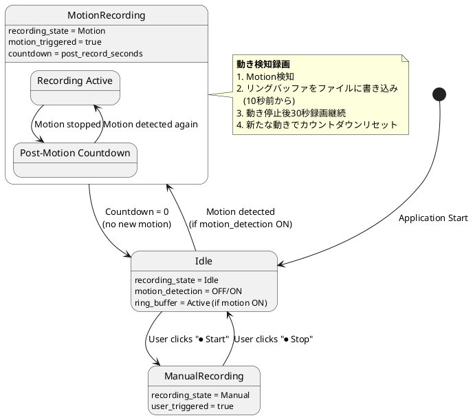

# Phase 5: 動き検知録画機能 仕様案

## 📋 ドキュメント情報

- **作成日**: 2026-01-02
- **対象フェーズ**: Phase 5.1 - 動き検知録画
- **目的**: 監視カメラとしての実用性向上
- **前提**: Phase 3録画機能が実装済み

---

## 1. 要件定義

### 1.1 ユーザー要件

> 監視カメラなので、人の動きを検知した時にその10sec前から一定時間を記録する仕組みも欲しいです。

**具体的要件:**
1. ✅ 人の動きを自動検知
2. ✅ 動き検知の**10秒前**から録画開始（プリバッファ）
3. ✅ 動き検知後、一定時間録画継続（ポストバッファ）
4. ✅ 既存の手動録画機能も維持

### 1.2 機能要件

| 項目 | 要件 |
|------|------|
| **動き検知アルゴリズム** | フレーム間差分法（軽量・高速） |
| **プリバッファ** | 常に最新10秒分のフレームをメモリ保持 |
| **録画トリガー** | 動き検知時に自動録画開始 |
| **録画継続時間** | 動き停止後、設定秒数（デフォルト30秒）録画継続 |
| **録画モード** | 手動録画 / 自動録画（動き検知） |
| **感度調整** | UI上でリアルタイム調整可能 |

### 1.3 非機能要件

| 項目 | 要件 |
|------|------|
| **メモリ使用量** | +10MB以内（現在200MB → 210MB以下） |
| **CPU負荷** | 動き検知処理 < 5ms/frame |
| **ストレージ** | 録画ファイルは既存と同じMJPEG形式 |
| **互換性** | Phase 3録画機能と共存 |

---

## 2. 技術方式の比較

### 2.1 実装オプション

#### Option A: PC側フレーム差分 ★推奨

**概要:**
- PC側でデコード済みRGBA画像を使用
- 前フレームとの差分を計算して動きを検知

**利点:**
- ✅ Spresense側の変更不要
- ✅ PC側のCPU性能が高い
- ✅ アルゴリズム調整が容易
- ✅ デコード済み画像を再利用（追加負荷最小）

**欠点:**
- ⚠️ PC側のCPU負荷が若干増加（ただし+2-5ms程度）

**実装難易度:** ★★☆☆☆（中）

#### Option B: PIRセンサー（人感センサー）

**概要:**
- Spresenseに外付けPIRセンサーを接続
- 赤外線で人の動きを検知

**利点:**
- ✅ 確実に人を検知
- ✅ CPU負荷なし
- ✅ 実装がシンプル

**欠点:**
- ❌ ハードウェア追加が必要
- ❌ 検知範囲が限定的
- ❌ 設置場所に依存

**実装難易度:** ★★★☆☆（中〜高、ハードウェア依存）

#### Option C: Spresense側で簡易検知

**概要:**
- Spresense側でJPEGエンコード前に動き検知

**利点:**
- ✅ PC側の負荷なし

**欠点:**
- ❌ Spresenseのリソース制約（既にCPU負荷高い）
- ❌ 精度が低い可能性
- ❌ Phase 2パイプライン実装への影響大

**実装難易度:** ★★★★☆（高）

### 2.2 推奨方式: Option A

**理由:**
1. ハードウェア追加不要
2. Spresense側への影響なし
3. PC側CPU性能を活用
4. アルゴリズム調整が容易

**採用決定:** Option A (PC側フレーム差分)

---

## 3. システム設計

### 3.1 アーキテクチャ概要

```plantuml
@startuml
skinparam componentStyle rectangle

actor User

package "GUI Thread" {
    component "CameraApp" as GUI {
        [Recording Controls]
        [Motion Detection UI]
        [Settings Panel]
    }

    component "Ring Buffer" as RING {
        [Frame Queue\n(10秒分)]
    }

    component "Motion Detector" as MOTION {
        [Frame Difference]
        [Threshold Check]
    }
}

package "Capture Thread" {
    component "Serial Read" as SERIAL
    component "JPEG Decode" as DECODE
}

database "Recording File" as FILE

SERIAL -> DECODE : MjpegPacket
DECODE -> GUI : DecodedFrame(RGBA)
GUI -> RING : Add frame
GUI -> MOTION : Check motion

alt Motion Detected
    MOTION -> GUI : Motion = true
    GUI -> GUI : Start auto recording
    GUI -> RING : Flush to file\n(10秒前のフレーム)
    GUI -> FILE : Write pre-buffer
    GUI -> FILE : Write current frames
else No Motion
    MOTION -> GUI : Motion = false
    GUI -> RING : Keep rotating
end

User -> GUI : Configure settings\n(sensitivity, pre/post time)

note right of RING
    **リングバッファ**
    - 容量: 110フレーム（10秒@11fps）
    - メモリ: 約6MB
    - 常時フレーム保持
end note

note right of MOTION
    **動き検知**
    - フレーム間差分
    - グレースケール変換
    - 処理時間: <5ms/frame
end note

@enduml
```

### 3.2 状態遷移図



### 3.3 データ構造

#### RecordingState の拡張

```rust
#[derive(Debug, Clone)]
enum RecordingState {
    Idle,

    /// 手動録画 (Phase 3)
    ManualRecording {
        filepath: PathBuf,
        start_time: Instant,
        frame_count: u32,
        total_bytes: u64,
    },

    /// 動き検知録画 (Phase 5)
    MotionRecording {
        filepath: PathBuf,
        start_time: Instant,
        frame_count: u32,
        total_bytes: u64,
        motion_active: bool,           // 現在動き検知中か
        countdown_frames: u32,         // ポスト録画残りフレーム数
    },
}
```

#### リングバッファ

```rust
use std::collections::VecDeque;

/// リングバッファ（プリバッファ用）
struct RingBuffer {
    frames: VecDeque<JpegFrame>,
    capacity: usize,               // 最大フレーム数（110フレーム = 10秒@11fps）
    total_bytes: usize,
}

struct JpegFrame {
    jpeg_data: Vec<u8>,            // JPEG画像データ
    timestamp: Instant,            // 受信時刻
}

impl RingBuffer {
    /// 新しいフレームを追加（古いフレームを自動削除）
    fn push(&mut self, frame: JpegFrame) {
        if self.frames.len() >= self.capacity {
            if let Some(old_frame) = self.frames.pop_front() {
                self.total_bytes -= old_frame.jpeg_data.len();
            }
        }

        self.total_bytes += frame.jpeg_data.len();
        self.frames.push_back(frame);
    }

    /// バッファ内の全フレームをファイルに書き込み
    fn flush_to_file(&self, file: &mut File) -> io::Result<()> {
        for frame in &self.frames {
            file.write_all(&frame.jpeg_data)?;
        }
        Ok(())
    }

    /// バッファクリア
    fn clear(&mut self) {
        self.frames.clear();
        self.total_bytes = 0;
    }
}
```

#### 動き検知設定

```rust
#[derive(Debug, Clone)]
struct MotionDetectionConfig {
    enabled: bool,                 // 動き検知ON/OFF
    sensitivity: f32,              // 感度 (0.0-1.0, デフォルト0.5)
    min_motion_area: f32,          // 最小動き領域 (%, デフォルト1.0%)
    pre_record_seconds: u32,       // プリ録画秒数（10秒）
    post_record_seconds: u32,      // ポスト録画秒数（30秒）
}

impl Default for MotionDetectionConfig {
    fn default() -> Self {
        Self {
            enabled: false,
            sensitivity: 0.5,
            min_motion_area: 1.0,
            pre_record_seconds: 10,
            post_record_seconds: 30,
        }
    }
}
```

#### 動き検知器

```rust
use image::{GrayImage, RgbaImage};

/// フレーム差分による動き検知
struct MotionDetector {
    previous_frame: Option<GrayImage>,
    config: MotionDetectionConfig,
}

impl MotionDetector {
    /// 動き検知実行
    fn detect(&mut self, current_frame: &RgbaImage) -> bool {
        // 1. グレースケール変換
        let gray = Self::rgba_to_gray(current_frame);

        if let Some(prev) = &self.previous_frame {
            // 2. フレーム差分計算
            let diff = Self::compute_difference(prev, &gray);

            // 3. 閾値処理
            let threshold = (self.config.sensitivity * 255.0) as u8;
            let changed_pixels = Self::count_changed_pixels(&diff, threshold);

            // 4. 動き判定
            let total_pixels = gray.width() * gray.height();
            let motion_ratio = (changed_pixels as f32) / (total_pixels as f32) * 100.0;

            self.previous_frame = Some(gray);

            motion_ratio >= self.config.min_motion_area
        } else {
            // 初回フレーム
            self.previous_frame = Some(gray);
            false
        }
    }

    /// RGBA → グレースケール変換
    fn rgba_to_gray(rgba: &RgbaImage) -> GrayImage {
        GrayImage::from_fn(rgba.width(), rgba.height(), |x, y| {
            let pixel = rgba.get_pixel(x, y);
            // 輝度計算: Y = 0.299*R + 0.587*G + 0.114*B
            let gray = (0.299 * pixel[0] as f32 +
                       0.587 * pixel[1] as f32 +
                       0.114 * pixel[2] as f32) as u8;
            image::Luma([gray])
        })
    }

    /// フレーム差分計算
    fn compute_difference(prev: &GrayImage, current: &GrayImage) -> GrayImage {
        GrayImage::from_fn(prev.width(), prev.height(), |x, y| {
            let prev_val = prev.get_pixel(x, y)[0] as i16;
            let curr_val = current.get_pixel(x, y)[0] as i16;
            let diff = (prev_val - curr_val).abs() as u8;
            image::Luma([diff])
        })
    }

    /// 閾値を超えたピクセル数をカウント
    fn count_changed_pixels(diff: &GrayImage, threshold: u8) -> usize {
        diff.pixels()
            .filter(|p| p[0] > threshold)
            .count()
    }
}
```

### 3.4 CameraApp への統合

```rust
struct CameraApp {
    // 既存フィールド (Phase 3)
    recording_state: RecordingState,
    recording_file: Option<Arc<Mutex<File>>>,
    is_recording: Arc<AtomicBool>,

    // Phase 5: 動き検知録画
    motion_config: MotionDetectionConfig,
    motion_detector: MotionDetector,
    ring_buffer: RingBuffer,
    last_motion_time: Option<Instant>,
}

impl CameraApp {
    /// フレーム受信時の処理（拡張版）
    fn process_decoded_frame(&mut self, rgba: RgbaImage, jpeg_data: Vec<u8>) {
        // 1. リングバッファに追加（動き検知ONの場合）
        if self.motion_config.enabled {
            self.ring_buffer.push(JpegFrame {
                jpeg_data: jpeg_data.clone(),
                timestamp: Instant::now(),
            });
        }

        // 2. 動き検知
        let motion_detected = if self.motion_config.enabled {
            self.motion_detector.detect(&rgba)
        } else {
            false
        };

        // 3. 録画状態管理
        match &mut self.recording_state {
            RecordingState::Idle => {
                if motion_detected {
                    // 動き検知録画開始
                    self.start_motion_recording().ok();
                }
            }

            RecordingState::MotionRecording {
                motion_active,
                countdown_frames,
                ..
            } => {
                if motion_detected {
                    // 動き検知継続 → カウントダウンリセット
                    *motion_active = true;
                    *countdown_frames = self.motion_config.post_record_seconds * 11; // 11 fps
                    self.last_motion_time = Some(Instant::now());
                } else {
                    // 動き停止 → カウントダウン
                    *motion_active = false;
                    if *countdown_frames > 0 {
                        *countdown_frames -= 1;
                    } else {
                        // カウントダウン終了 → 録画停止
                        self.stop_recording().ok();
                    }
                }

                // フレーム書き込み
                self.write_frame(&jpeg_data).ok();
            }

            RecordingState::ManualRecording { .. } => {
                // 手動録画中はフレーム書き込みのみ
                self.write_frame(&jpeg_data).ok();
            }
        }

        // 4. 画面表示（既存処理）
        // ...
    }

    /// 動き検知録画開始
    fn start_motion_recording(&mut self) -> io::Result<()> {
        // ファイル作成
        std::fs::create_dir_all(&self.recording_dir)?;
        let now = chrono::Local::now();
        let filename = format!("motion_{}.mjpeg", now.format("%Y%m%d_%H%M%S"));
        let filepath = self.recording_dir.join(&filename);

        let mut file = File::create(&filepath)?;

        // リングバッファをファイルに書き込み（10秒前から）
        self.ring_buffer.flush_to_file(&mut file)?;

        let pre_buffer_frames = self.ring_buffer.frames.len() as u32;
        let pre_buffer_bytes = self.ring_buffer.total_bytes as u64;

        info!("Motion recording started with pre-buffer:");
        info!("  Frames: {}", pre_buffer_frames);
        info!("  Size: {:.2} MB", pre_buffer_bytes as f32 / 1_000_000.0);

        self.recording_file = Some(Arc::new(Mutex::new(file)));

        self.recording_state = RecordingState::MotionRecording {
            filepath,
            start_time: Instant::now(),
            frame_count: pre_buffer_frames,
            total_bytes: pre_buffer_bytes,
            motion_active: true,
            countdown_frames: self.motion_config.post_record_seconds * 11,
        };

        self.is_recording.store(true, Ordering::Relaxed);

        Ok(())
    }
}
```

---

## 4. UI設計

### 4.1 新規UI要素

```
┌──────────────────────────────────────────────────────┐
│ Top Panel: Controls                                  │
│ [▶ Start] [⏹ Stop]   Status: Connected              │
│                                                       │
│ 📹 Recording Mode:  ( ) Manual  (●) Motion Detection │
├────────┬─────────────────────────────────────────────┤
│        │                                              │
│ Side   │  Central Panel: Video Display               │
│ Panel  │                                              │
│        │  ┌───────────────────────────────────────┐  │
│ Motion │  │                                       │  │
│ Settings│  │     Camera Feed (640x480)            │  │
│        │  │                                       │  │
│ ☑ Enable│  │     [🔴 Motion!] ← 動き検知表示     │  │
│        │  │                                       │  │
│ Sens:  │  └───────────────────────────────────────┘  │
│ [====●-]│                                             │
│  50%   │                                             │
│        │                                              │
│ Pre:   │                                              │
│ [10]sec│                                              │
│        │                                              │
│ Post:  │                                              │
│ [30]sec│                                              │
├────────┴─────────────────────────────────────────────┤
│ Bottom Panel: Statistics                             │
│ 📊 PC: 19.9 fps | 🎬 Frames: 1234 |                 │
│ 🔴 Motion: ACTIVE | ⏱ Countdown: 25s                │
└──────────────────────────────────────────────────────┘
```

### 4.2 新規コントロール

| コントロール | 説明 |
|-------------|------|
| **Recording Mode** | ラジオボタン: Manual / Motion Detection |
| **Enable Motion** | チェックボックス: 動き検知ON/OFF |
| **Sensitivity** | スライダー: 0-100% (デフォルト50%) |
| **Pre-record** | 数値入力: 5-30秒 (デフォルト10秒) |
| **Post-record** | 数値入力: 10-60秒 (デフォルト30秒) |
| **Motion Indicator** | 🔴アイコン: 動き検知中に表示 |

---

## 5. メモリ・性能分析

### 5.1 メモリ使用量

| 項目 | サイズ | 備考 |
|------|--------|------|
| **リングバッファ** | 6.05 MB | 110フレーム × 55KB |
| **グレースケール画像** | 307 KB | 640×480 (動き検知用) |
| **前フレーム保持** | 307 KB | 差分計算用 |
| **合計増加** | **約6.7 MB** | 現在200MB → 206.7MB (+3.4%) |

### 5.2 処理時間

| 処理 | 時間 | 備考 |
|------|------|------|
| **RGBA → Gray変換** | ~1.5ms | 640×480ピクセル |
| **フレーム差分計算** | ~2.0ms | 640×480ピクセル |
| **閾値処理・カウント** | ~0.5ms | 並列処理可能 |
| **合計** | **~4ms/frame** | 目標5ms以内 ✅ |

### 5.3 CPU負荷

- 現在のPC側処理時間: 約50ms/frame
- 動き検知追加後: 約54ms/frame (+4ms, +8%)
- **影響**: 軽微（FPSは19.9 fps維持可能）

---

## 6. 実装計画

### 6.1 Phase 5.1 実装ステップ

#### Step 1: リングバッファ実装 (2-3時間)

**ファイル:** `src/ring_buffer.rs` (新規)

**内容:**
- `RingBuffer` 構造体
- `push()`, `flush_to_file()`, `clear()` メソッド
- ユニットテスト

#### Step 2: 動き検知アルゴリズム実装 (3-4時間)

**ファイル:** `src/motion_detector.rs` (新規)

**内容:**
- `MotionDetector` 構造体
- `detect()`, `rgba_to_gray()`, `compute_difference()` メソッド
- 感度・閾値調整機能
- ユニットテスト

#### Step 3: RecordingState 拡張 (2-3時間)

**ファイル:** `src/gui_main.rs` (修正)

**内容:**
- `RecordingState::MotionRecording` 追加
- `start_motion_recording()`, `stop_recording()` 修正
- `process_decoded_frame()` 統合

#### Step 4: UI更新 (2-3時間)

**ファイル:** `src/gui_main.rs` (修正)

**内容:**
- 動き検知設定パネル
- 感度スライダー
- Pre/Post録画時間設定
- Motion Indicator表示

#### Step 5: テスト・デバッグ (2-3時間)

**テスト項目:**
- [ ] リングバッファの正常動作
- [ ] 動き検知の精度確認
- [ ] プリバッファの正確性（10秒前から記録）
- [ ] ポストバッファの動作（30秒録画継続）
- [ ] メモリリーク確認
- [ ] 長時間動作テスト（1時間）

### 6.2 実装時間見積もり

| ステップ | 時間 |
|---------|------|
| Step 1: リングバッファ | 2-3時間 |
| Step 2: 動き検知 | 3-4時間 |
| Step 3: RecordingState拡張 | 2-3時間 |
| Step 4: UI更新 | 2-3時間 |
| Step 5: テスト | 2-3時間 |
| **合計** | **11-16時間** (2-3日) |

---

## 7. 代替案・将来拡張

### 7.1 代替アルゴリズム

| アルゴリズム | 精度 | CPU負荷 | 実装難易度 |
|-------------|------|---------|-----------|
| **フレーム差分** (採用) | ★★★☆☆ | ★★☆☆☆ | ★★☆☆☆ |
| 背景差分 (Background Subtraction) | ★★★★☆ | ★★★☆☆ | ★★★☆☆ |
| オプティカルフロー (Optical Flow) | ★★★★★ | ★★★★★ | ★★★★☆ |
| CNN (Deep Learning) | ★★★★★ | ★★★★★ | ★★★★★ |

### 7.2 Phase 5.2 将来拡張案

1. **背景差分法の実装**
   - より高精度な動き検知
   - 照明変化に強い

2. **物体検出（YOLOv5など）**
   - 人のみを検出（車・動物を無視）
   - GPU使用で高速化

3. **複数の検知ゾーン設定**
   - 画面内の特定領域のみ監視
   - ゾーンごとに感度設定

4. **顔認識・人物追跡**
   - 特定人物の検知
   - 移動軌跡の記録

5. **音声検知統合**
   - マイク入力で音声検知
   - 動き+音声で高精度化

---

## 8. リスク・課題

### 8.1 技術的リスク

| リスク | 影響 | 対策 |
|--------|------|------|
| **誤検知（False Positive）** | 中 | 感度調整UI、最小動き領域設定 |
| **検知漏れ（False Negative）** | 中 | 複数アルゴリズムの組み合わせ（将来） |
| **照明変化の影響** | 中 | 背景差分法への移行（Phase 5.2） |
| **メモリ不足** | 低 | 10秒→5秒へ調整可能 |
| **CPU負荷増加** | 低 | 実測4ms、目標5ms以内 ✅ |

### 8.2 運用上の課題

| 課題 | 対策 |
|------|------|
| **ストレージ容量** | 古い録画ファイルの自動削除機能（Phase 5.3） |
| **夜間の動き検知** | IR照明の追加、または赤外線カメラ対応 |
| **設定の最適化** | プリセット提供（屋内/屋外/夜間） |

---

## 9. まとめ

### 9.1 推奨実装方式

**Phase 5.1: PC側フレーム差分 + プリバッファ**

- ✅ ハードウェア追加不要
- ✅ Spresense側への影響なし
- ✅ 実装難易度: 中
- ✅ 実装期間: 2-3日（11-16時間）
- ✅ メモリ増加: +6.7MB (+3.4%)
- ✅ CPU負荷増加: +4ms (+8%)

### 9.2 ユーザーベネフィット

1. **24時間監視の実現**: 手動録画不要、自動で動きを検知
2. **証拠の確保**: 10秒前から録画で、イベント発生前の状況も記録
3. **ストレージ節約**: 動きがある時のみ録画
4. **実用的な監視カメラ**: 監視カメラとしての必須機能を実装

### 9.3 次のステップ

**ご確認いただきたい点:**

1. ✅ プリバッファ10秒、ポストバッファ30秒で良いか
2. ✅ PC側フレーム差分方式で良いか（Option A）
3. ✅ メモリ+6.7MB、CPU負荷+4msは許容範囲か
4. ✅ 実装優先度（すぐ実装 or Phase 4テスト後）

**承認いただければ、Step 1から実装開始します。**

---

**文書バージョン**: 1.0
**最終更新**: 2026-01-02
**ステータス**: ✅ 仕様案レビュー待ち
